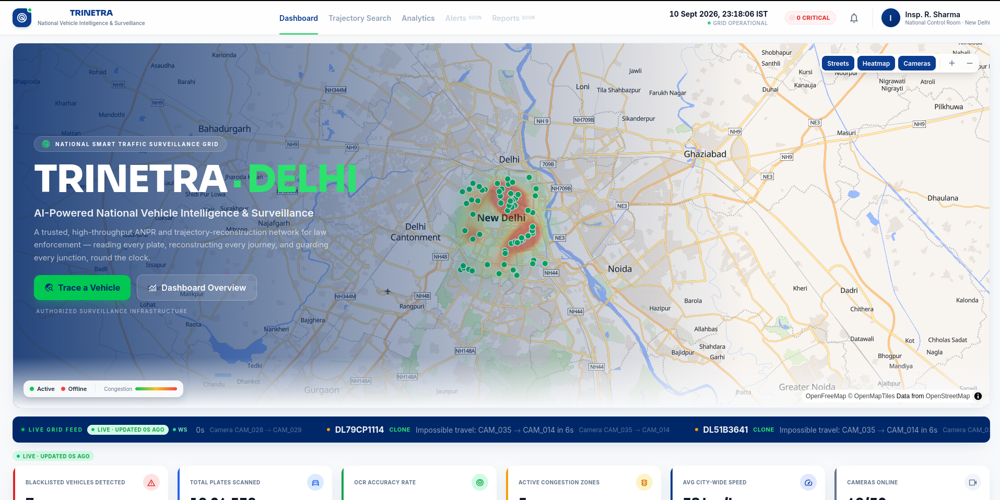
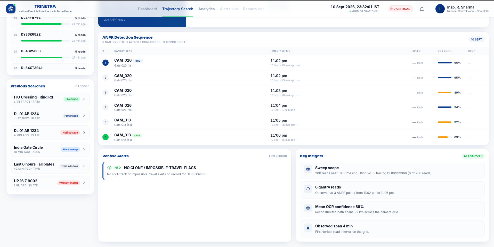
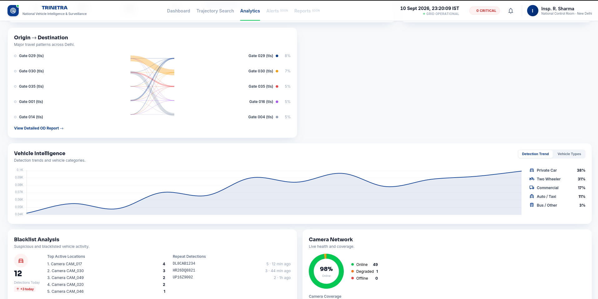

# BAAZIGARS-SIH26127
# SIH 2026 Project Repository — TRINETRA
 
This repository contains our submission for SIH 2026.
 
---
 
## 1. Project Information
 
- **Project Title:** TRINETRA – City-Wide AI Engine for Multi-Camera ANPR & Traffic Intelligence
- **PS ID:** SIH26127
- **PS Title:** City-Wide AI Engine for Multi-Camera Vehicle Identification, Trajectory Tracking, and Real-Time Traffic Analytics
- **Category:** Software
- **Theme:** Smart City / Public Safety & Transportation
---
 
## 2. Problem Statement
 
- Large cities operate thousands of traffic and CCTV cameras, but each one works in isolation.
- There is no way to trace a single vehicle's journey across multiple cameras.
- There is no unified view of city-wide traffic conditions.
- There is no automated mechanism to flag suspicious activity such as stolen vehicles or cloned number plates in real time.
- Traffic authorities are left with fragmented, camera-by-camera data instead of a single, actionable, city-wide picture.
---
 
## 3. Proposed Solution
 
- TRINETRA is a unified traffic intelligence platform that connects ANPR (Automatic Number Plate Recognition) cameras across a city into a single, live control room.
- Each camera detects and reads vehicle number plates and sends a lightweight "sighting" event such as plate number, camera location, timestamp, confidence score instead of streaming raw video.
- The system links sightings of the same vehicle across different cameras and reconstructs its route on a live map.
- The system continuously computes city-wide traffic statistics (heatmaps, congestion, origin–destination flows).
- The system detects anomalies such as blacklisted vehicles and cloned/impossible-travel plates, raising alerts within seconds.
- Since a real city's camera network cannot be used for testing, we built a realistic simulation of Delhi's CP, South Ex road network (real OpenStreetMap data) with ~60 virtual camera locations at real junctions (Connaught Place, Janpath, India Gate, Lodi Road, South Ex) and thousands of simulated vehicles generating rush-hour traffic patterns.
- Every camera simulated or real speaks the same event contract, so switching from simulated to real camera feeds requires no change to the rest of the system.
---
 
## 4. Key Features
 
- **Automatic Plate Recognition (ANPR/OCR)** : designed for >90% recognition accuracy across degraded conditions (blur, night, rain, angle).
- **Multi-Camera Vehicle Trajectory Tracking** : type a plate number and see its full route across the city, with per-hop timestamps, speed, and confidence.
- **Live Traffic Analytics** : real-time heatmaps, congestion detection, origin–destination (OD) patterns, peak-hour curves, and camera health monitoring.
- **Instant Alerts** : blacklist hits and clone/impossible-travel detection (same plate seen in two distant places too quickly), delivered in under a few seconds.
- **Identity Resolution Engine** : fuzzy matching merges noisy/near-duplicate OCR reads into a single consistent vehicle record.
- **Simulation-First, Deployment-Ready Architecture** : same pipeline works on simulated or real camera feeds; deployable to any city by swapping in its road map and camera locations.
- **Transparent Accuracy Reporting** : an accuracy scorecard shows real performance per condition rather than a single inflated number.
---

## 5. Technology Stack
 
- **Frontend:** React, MapLibre GL, Chart.js, nginx (build serving)
- **Backend:** Python 3.12, microservices architecture (Ingest API, Matcher, Analytics, Alerts workers, REST + WebSocket API)
- **Machine Learning / AI:**
  - Custom ANPR engine (stub today for development, [fast-alpr](https://github.com/ankandrew/fast-alpr) planned for production OCR)
  - Levenshtein-distance-based fuzzy plate matching for identity resolution
- **Database:** PostgreSQL with TimescaleDB (time-series hypertables for vehicle "reads") and PostGIS (geospatial queries)
- **Messaging / Streaming:** Redis Streams (sharded, multi-consumer-group event pipeline)
- **Simulation:** SUMO (Simulation of Urban MObility) via libsumo, driven by real OpenStreetMap (OSM) road network data
- **APIs:** REST (OpenAPI-documented — vehicle search, trajectory, analytics, blacklist, alerts, accuracy) + WebSocket protocol for real-time push updates
- **Deployment:** Podman Compose (Docker-compatible), containerized microservices
- **Dev Tools:** Python venv, Node.js 22, custom smoke-test and load-test scripts (`smoke.sh`, `replay_gun.py`, `fake_camera.py`)

---

## 6. Demo Screenshots

Live captures from the running system (Delhi CP–South Ex simulation, 60 virtual cameras).

### Live dashboard — city breathing, alert ticker, honest LIVE badges

### Plate trajectory — one plate traced across the ANPR grid

### Area sweep — every vehicle in scope, ranked, one click retraces any of them

### Detection evidence — per-hop timestamps, confidence bars, sweep-scope insight

### Blacklist admin + alerts inbox

### Analytics page — OD flows, congestion, camera health

### ANPR service — vehicle detection and plate OCR on real footage (rig average above 90%)

