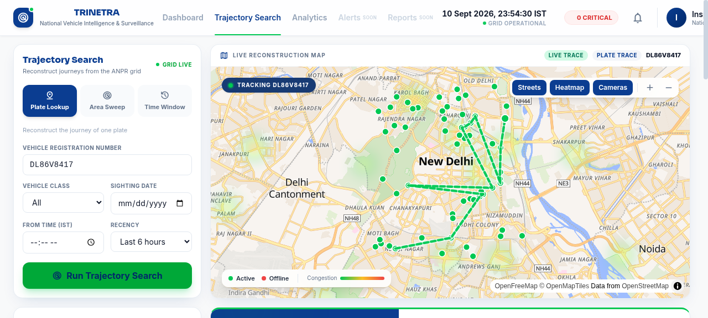
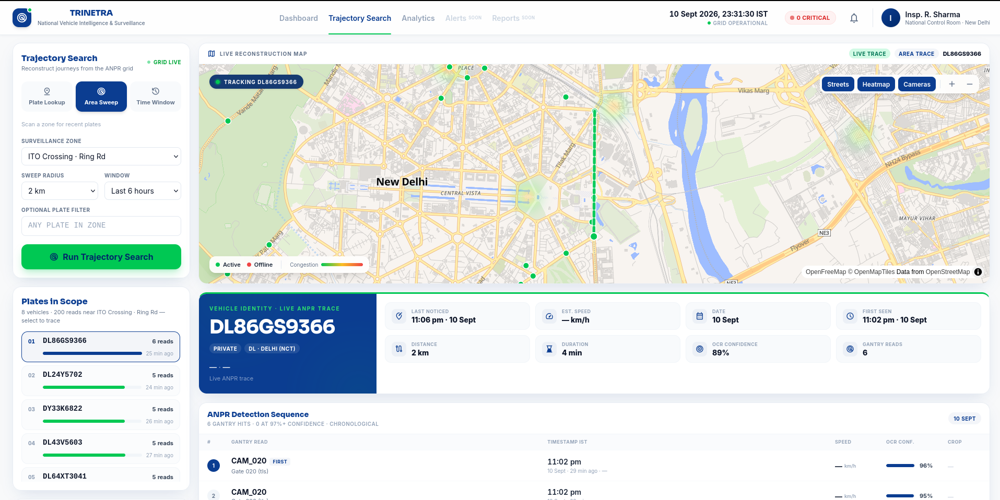
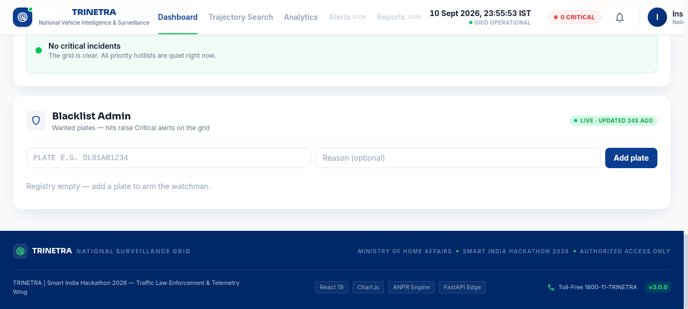
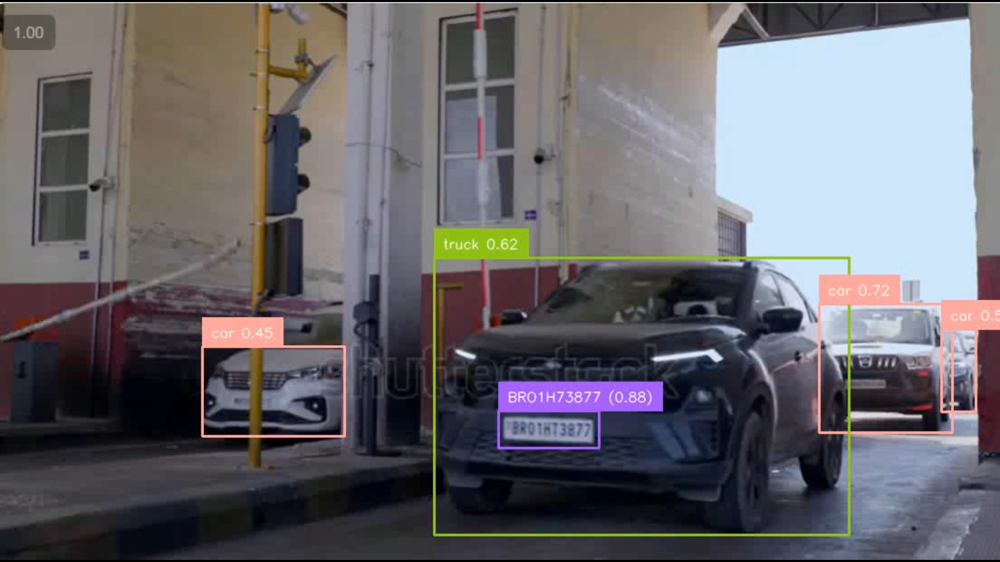

# BAAZIGARS-SIH26127
# SIH 2026 Project Repository — TRINETRA
 
This repository contains our submission for SIH 2026.

📊 **Idea Presentation:** [BAAZIGARS_SIH2026_PRESENTATION.pptx](presentation/BAAZIGARS_SIH2026_PRESENTATION.pptx)

---
 
## Demo — live captures from the running system

Delhi CP–South Ex simulation, 60 virtual cameras.

| Live dashboard — city breathing, alert ticker, honest LIVE badges | Plate trajectory — one plate traced across the ANPR grid |
|---|---|
|  |  |

| Area sweep — every vehicle in scope, ranked, one click retraces any of them | Detection evidence — per-hop timestamps, confidence bars, sweep-scope insight |
|---|---|
|  |  |

| Blacklist admin + alerts inbox | Analytics page — OD flows, congestion, camera health |
|---|---|
|  |  |

| ANPR service — vehicle detection and plate OCR on real footage (rig average above 90%) |
|---|
|  |

---
 
## 1. Project Information
 
- **Project Title:** TRINETRA – City-Wide AI Engine for Multi-Camera ANPR & Traffic Intelligence
- **PS ID:** SIH26127
- **PS Title:** City-Wide AI Engine for Multi-Camera Vehicle Identification, Trajectory Tracking, and Real-Time Traffic Analytics
- **Category:** Software
- **Theme:** Smart City / Public Safety & Transportation
---
 
## 2. Problem Statement
 
- Large cities operate thousands of traffic and CCTV cameras, but each one works in isolation.
- There is no way to trace a single vehicle's journey across multiple cameras.
- There is no unified view of city-wide traffic conditions.
- There is no automated mechanism to flag suspicious activity such as stolen vehicles or cloned number plates in real time.
- Traffic authorities are left with fragmented, camera-by-camera data instead of a single, actionable, city-wide picture.
---
 
## 3. Proposed Solution
 
- TRINETRA is a unified traffic intelligence platform that connects ANPR (Automatic Number Plate Recognition) cameras across a city into a single, live control room.
- Each camera detects and reads vehicle number plates and sends a lightweight "sighting" event such as plate number, camera location, timestamp, confidence score instead of streaming raw video.
- The system links sightings of the same vehicle across different cameras and reconstructs its route on a live map.
- The system continuously computes city-wide traffic statistics (heatmaps, congestion, origin–destination flows).
- The system detects anomalies such as blacklisted vehicles and cloned/impossible-travel plates, raising alerts within seconds.
- Since a real city's camera network cannot be used for testing, we built a realistic simulation of Delhi's CP, South Ex road network (real OpenStreetMap data) with ~60 virtual camera locations at real junctions (Connaught Place, Janpath, India Gate, Lodi Road, South Ex) and thousands of simulated vehicles generating rush-hour traffic patterns.
- Every camera simulated or real speaks the same event contract, so switching from simulated to real camera feeds requires no change to the rest of the system.
---
 
## 4. Key Features
 
- **Automatic Plate Recognition (ANPR/OCR)** : designed for >90% recognition accuracy across degraded conditions (blur, night, rain, angle).
- **Multi-Camera Vehicle Trajectory Tracking** : type a plate number and see its full route across the city, with per-hop timestamps, speed, and confidence.
- **Live Traffic Analytics** : real-time heatmaps, congestion detection, origin–destination (OD) patterns, peak-hour curves, and camera health monitoring.
- **Instant Alerts** : blacklist hits and clone/impossible-travel detection (same plate seen in two distant places too quickly), delivered in under a few seconds.
- **Identity Resolution Engine** : fuzzy matching merges noisy/near-duplicate OCR reads into a single consistent vehicle record.
- **Simulation-First, Deployment-Ready Architecture** : same pipeline works on simulated or real camera feeds; deployable to any city by swapping in its road map and camera locations.
- **Transparent Accuracy Reporting** : an accuracy scorecard shows real performance per condition rather than a single inflated number.
---

## 5. Technology Stack
 
- **Frontend:** React, MapLibre GL, Chart.js, nginx (build serving)
- **Backend:** Python 3.12, microservices architecture (Ingest API, Matcher, Analytics, Alerts workers, REST + WebSocket API)
- **Machine Learning / AI:**
  - Custom ANPR engine (stub today for development, [fast-alpr](https://github.com/ankandrew/fast-alpr) planned for production OCR)
  - Levenshtein-distance-based fuzzy plate matching for identity resolution
- **Database:** PostgreSQL with TimescaleDB (time-series hypertables for vehicle "reads") and PostGIS (geospatial queries)
- **Messaging / Streaming:** Redis Streams (sharded, multi-consumer-group event pipeline)
- **Simulation:** SUMO (Simulation of Urban MObility) via libsumo, driven by real OpenStreetMap (OSM) road network data
- **APIs:** REST (OpenAPI-documented — vehicle search, trajectory, analytics, blacklist, alerts, accuracy) + WebSocket protocol for real-time push updates
- **Deployment:** Podman Compose (Docker-compatible), containerized microservices
- **Dev Tools:** Python venv, Node.js 22, custom smoke-test and load-test scripts (`smoke.sh`, `replay_gun.py`, `fake_camera.py`)

---

## 6. Architecture

See [docs/architecture.md](docs/architecture.md) for the full guide.

```
Camera / SUMO gates ──▶ ANPR service ──▶ Ingest API ──▶ Redis Streams (8 shards)
   plate, cam, time      read + correct      validate + queue      3 consumer groups
                                                     │
                    ┌────────────────────────────────┼────────────────────────────────┐
                    ▼                                ▼                                ▼
              Matcher worker                   Analytics worker                   Alerts worker
         fuzzy identity (edit≤1)          rollups, OD, congestion           blacklist + clone travel
                    └────────────────────────────────┼────────────────────────────────┘
                                                     ▼
                                   TimescaleDB (Postgres + PostGIS)
                                   one `reads` table drives everything
                                                     │
                              ┌──────────────────────┴──────────────────────┐
                              ▼                                             ▼
                    FastAPI (REST + WebSocket)                  React dashboard
              search · trajectory · analytics · ack           live map · ticker · investigate
```

---

## 7. Repository Structure

```
BAAZIGARS-SIH26127/
├── README.md                  ← you are here
├── docs/
│   └── architecture.md        ← plain-words system guide for judges
├── submission/                ← DEMO.md (video link) + PRESENTATION.md
├── backend/                   ← event pipeline, workers, sim, schema, compose
│   ├── api/                   ← REST + WebSocket hub (:8002)
│   ├── ingest/                ← event intake (:8000)
│   ├── workers/               ← matcher / analytics / alerts
│   ├── anpr_stub/             ← dev ANPR engine (real model swaps in later)
│   ├── sim/                   ← SUMO Delhi runner + demand tooling
│   ├── sql/                   ← TimescaleDB + PostGIS schema
│   ├── scripts/               ← gates, smoke test, replay-gun, fixtures
│   ├── tests/                 ← unit + contract tests
│   ├── openapi/               ← API / ingest / WS contracts
│   └── docker-compose.yml     ← full stack (Redis, Timescale, workers, sim)
├── frontend/                  ← React + Vite + MapLibre dashboard
│   └── src/                   ← map, ticker, trajectory, analytics, admin
├── violation-tracking-system/ ← teammate YOLO subsystem (with weights)
├── assets/
│   └── screenshots/           ← demo captures (§10)
└── presentation/              ← SIH idea deck (§8)
```

---

## 8. Final Presentation

The SIH idea presentation is committed in this repo (see [submission/PRESENTATION.md](submission/PRESENTATION.md) for format notes):

[presentation/BAAZIGARS_SIH2026_PRESENTATION.pptx](presentation/BAAZIGARS_SIH2026_PRESENTATION.pptx)

---

## 9. Demo Video

See [submission/DEMO.md](submission/DEMO.md) for the video brief.

- 🎬 **Demo video (YouTube):** https://youtu.be/dd6dAWBIKj8
- 📁 **Project Drive (videos & assets):** https://drive.google.com/drive/folders/13JUpZgb1FCb6qudszBcJbTX5blMlsHuS

---

## 10. Screenshots / Prototype Photos

All demo captures live in [`assets/screenshots/`](assets/screenshots/) and are shown at the top of this README under [Demo](#demo--live-captures-from-the-running-system).

---

## 11. Installation

```bash
git clone https://github.com/officialxerocodes-cloud/BAAZIGARS-SIH26127.git
cd BAAZIGARS-SIH26127

# Backend deps (Python 3.12) — from backend/
cd backend
python3.12 -m venv .venv-sumo
.venv-sumo/bin/pip install -r requirements-sumo.txt

# Frontend deps (Node 22) — from frontend/
cd ../frontend
npm ci
```

Requires: `podman compose` (or `docker compose`), Python 3.12, Node 22.

---

## 12. Run

```bash
cd backend
cp .env.example .env   # safe defaults for local compose

# Full stack: infra + pipeline + dashboard + dev ANPR engine
podman compose up -d --build
podman compose --profile anpr-stub up -d --build

# Seed the 60 camera gates, then gate the pipeline
PYTHONPATH=. .venv-sumo/bin/python scripts/generate_gates.py \
  --net delhi.net.xml --out delhi_gates.json --n 60 --apply-db
bash scripts/smoke.sh   # must print PASSED
```

Then run simulated traffic and open the dashboard:

```bash
PYTHONPATH=. .venv-sumo/bin/python -m sim.runner --duration 600 --rate 30 --seed 7
# Dashboard → http://localhost:5173   API → http://localhost:8002
```

---

## 13. Future Scope

- Swap the ANPR stub for the trained `fast-alpr` engine behind the same `ANPR_CONTRACT.md` (no downstream changes).
- Routed road distances for the impossible-travel check (haversine today).
- Full WebSocket fan-out (viewport-scoped ticks, sampled event stream) beyond the current alerts push.
- Real-footage `FileSource`/`RTSP` cameras and MJPEG hero tiles.
- Clone split-track comparison view and blacklist admin polish.
- Per-condition accuracy rig wired to the dashboard Accuracy page.

---

## Important

Before submission, make sure the repository is accessible to reviewers. Do **not** upload passwords, API keys, access tokens, `.env` files containing secrets, or other confidential credentials. This repo ships `.env.example` files only — all secrets stay local.
